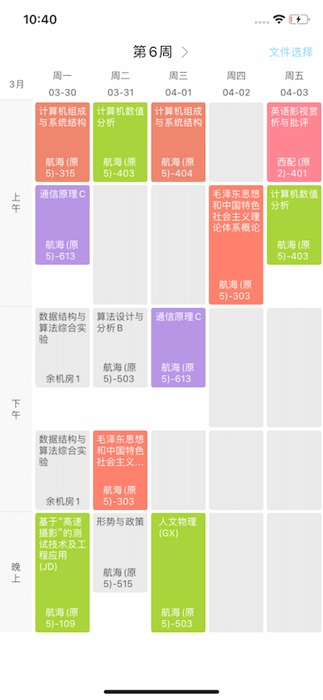

# iwut_flutter

使用 Flutter 编写的新掌理 Android 端，2020-2021



## 项目说明

-   原版为 flutter 2.5.2，现已适配 3.13.x
-   网络请求已经改为 mock，应用内时间 now 已经全部替换为 2021-08-30
-   ~~课表解析部分代码已经移除~~

生成 release

```bash
flutter build apk --split-per-abi
```
